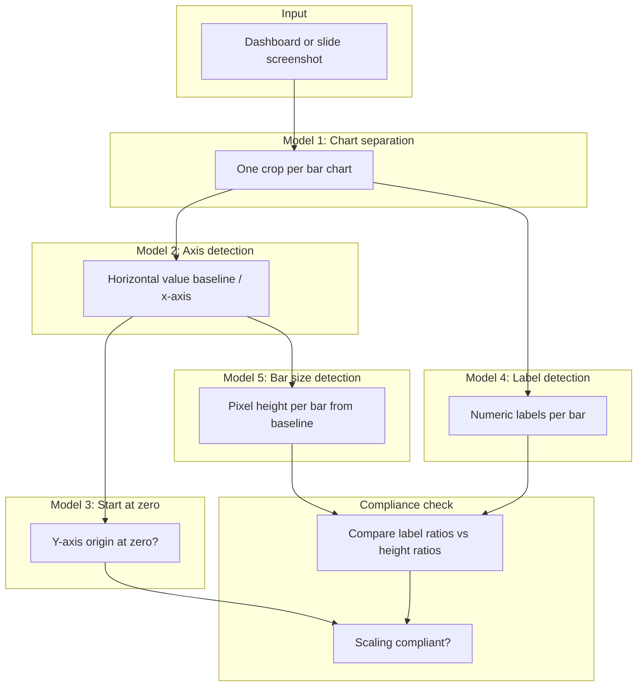

# IBCS scaling compliance: full ML pipeline

## Summary

The system checks bar charts on business dashboards against International Business Communication Standards (IBCS) for visual scaling. A single screenshot can hold many charts plus filters and UI chrome. The pipeline crops each chart, reads geometry and numeric labels, then compares what the labels say with how tall the bars are drawn. If those do not line up, the chart probably has a scaling or axis problem and fails the IBCS check.

Five models run in sequence. Each one does one job. Later steps only see crops from earlier steps. The last step is not detection: it measures bar heights in pixels, converts them to implied values, and checks them against the labels.

## Why scaling matters

IBCS bar charts normally:

1. Start the value axis at zero (no truncated axis that blows up small differences).
2. Draw bar heights in proportion to the numbers they represent.
3. Show data labels readers can use to verify the graphic.

A frequent failure is distorted scaling: the axis does not start at zero, or bar heights do not match the printed values. Small gaps look huge, or big gaps look small. The pipeline automates what an auditor would do by hand: read the labels, measure the bars, and see if the picture matches the math.

Per chart, the system returns pass/fail or a score, plus review overlays (baseline, label boxes, measurement lines).

## Pipeline overview



Models 2 through 5 all take the chart crop from Model 1. Model 3 can use the detected axis and plot margins. Model 5 needs the baseline Y from Model 2. Models 4 and 5 both feed the compliance check.

## Model 1: chart separation

Find and isolate each bar chart on a busy dashboard.

Input: a full-page or full-slide image (PNG and similar). Output: one bounding crop per chart, preferably the plot area without titles, legends, or filters. In practice this is often object detection (YOLO trained on a `bar_chart` class) plus optional cropping to drop chrome.

Scaling rules apply per chart. If side-by-side charts, KPI tiles, or tables get lumped into one region, everything downstream fails. A bad crop gives you the wrong axis, labels, and bar heights. On real dashboards, detectors often merge adjacent charts, swallow chrome, miss small charts, or distort boxes after resize. See [yolo-dashboard-chart-detection-report.md](./yolo-dashboard-chart-detection-report.md) for how YOLO behaves on dashboard separation.

## Model 2: x-axis detection

Locate the horizontal baseline where bars sit (the category axis or plot floor).

Input: one chart crop. Output: one or more horizontal line positions as Y coordinates in pixels, with confidence. Methods include Hough lines, morphological horizontal openings, corner clustering along bar bottoms, or a small model trained on axis strokes.

Bar height is measured upward from this line. Without a stable baseline, pixel counts are useless. Review UIs often draw the baseline in a strong color (orange is common).

Model 5 pins each bar's bottom to this line, or to a shared floor aligned across bars in one series. Model 3 may reuse the same geometry to see where the value axis meets the plot.

## Model 3: start at zero

Check whether the value axis begins at zero, which standard IBCS bar charts require.

Input: the crop, axis geometry from Model 2, and optionally OCR on y-axis ticks. Output: a yes/no or graded flag (`starts_at_zero`, truncated axis suspected) plus evidence such as the lowest tick value or a gap between the axis origin and the plot floor. Typical steps: read y-axis labels, see if the plot floor lines up with "0", detect axis breaks or zoomed ranges.

A non-zero origin can mislead readers even when bar ratios within the chart are internally consistent. That is separate from the label-vs-height ratio test but still part of IBCS compliance. Truncated axes are allowed in some IBCS cases if notation is explicit; product rules should say when Model 3 is a hard fail vs. a warning.

## Model 4: label detection

Find numeric data labels on or near each bar (or series).

Input: the crop; bar positions from Model 5 help match labels to bars. Output per bar: bounding box, parsed number, unit (k, M, %), confidence. Text detection plus OCR is common; some teams train a dedicated label detector on IBCS-style charts.

Labels are what the chart claims. The compliance step treats them as the stated values. Normalize before compare (`240k` → 240000). Link each label to the right bar by horizontal overlap, nearest bar center, or category order. Wrong pairing creates false scaling violations.

## Model 5: bar size detection

Measure how tall each bar is in pixels from the baseline to the top, including IBCS fill styles (actual, budget, forecast hatch, and so on).

Input: the crop, baseline Y from Model 2, optional masks per fill type. Output per bar: position and height in pixels, and series type when several encodings appear. Classical vision (masks, projection profiles, corner pairing) and segmentation both show up here; QA overlays often draw vertical measure lines like a ruler.

This step records what was actually drawn. IBCS expects height ratios to match value ratios after one scale factor. Model 5 does not read numbers; it measures ink.

Mixed styling is normal: solid actual bars, grey plan bars, hatched forecast. For scaling checks, measure the primary actual series, or define rules per series so plan bars are not compared to actual labels.

## Compliance logic

After Models 2-5 run on one crop:

1. Model 3: if the value axis does not start at zero, flag non-compliance (or a warning, per policy).
2. Pick a reference bar (e.g. tallest actual bar with a confident label).
3. Implied scale: `scale = label_value_reference / height_px_reference`
4. For each other labeled bar: `expected_height = label_value / scale`, then compare to `measured_height_px` within tolerance for anti-aliasing, sub-pixel bars, and rounding.
5. Equivalent ratio test: `label_i / label_j` should be close to `height_i / height_j` for pairs with reliable detections.

Systematic error usually means wrong scaling (bad axis, mixed units, labels from another series). Small scattered error may be OCR or detection noise; tune thresholds on labeled compliant and non-compliant sets.

```text
  Compliant:     h1/h2 ≈ v1/v2     and     axis starts at 0
  Non-compliant: heights disagree with labels and/or axis truncated
```

## Data flow

| Stage | Model | Primary output | Used by |
|-------|--------|----------------|---------|
| 1 | Chart separation | Chart crops | All later models |
| 2 | X-axis detection | Baseline Y | Model 5, compliance geometry |
| 3 | Start at zero | Axis origin OK? | Final verdict |
| 4 | Label detection | Values per bar | Compliance ratios |
| 5 | Bar size detection | Heights per bar | Compliance ratios |

## What breaks in production

Separation errors (merged or split boxes) starve or poison the rest of the pipeline. Gridlines mistaken for the axis skew heights. OCR trips on `k`/`M` suffixes and comma decimals. Hatched or stacked series can measure the wrong layer. Multi-series charts fail when actual labels get compared to plan bar heights.

Review overlays should show the baseline, label boxes, and vertical measures per bar so a human can confirm or override before results go into a compliance workflow.

## Code in this repo

Model 1: YOLOv8 train/validate/predict in `train.py`, synthetic charts in `synthetic_gen/`. Dashboard separation notes are in the YOLO report linked above.

Models 2 and 5 (geometry): OpenCV pipeline under `scaling-detection/` (axis fusion, corner-based bar boxes, projection masks). Label detection and zero-axis checks are planned extensions, not finished modules.

Bar box quality before scaling rules: IoU metrics in `scaling-detection/metrics.py`.

## Closing note

A dashboard image becomes an IBCS scaling audit by cropping charts, finding the real baseline, checking for a zero-based value axis, reading labels, and measuring bar heights. There is no single "scaling classifier." Compliance is whether those signals agree. Model 1 sets scope; Models 2 and 3 cover axis honesty; Models 4 and 5 supply the numbers to test whether the graphic matches its labels.
